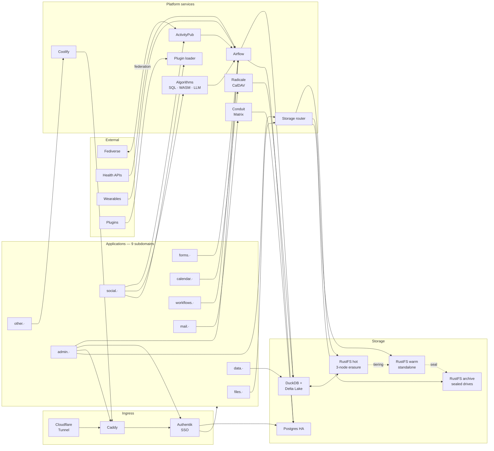

# A Blaze of Life — Development Roadmap

> A personal cloud OS: fediverse social, local lakehouse, self-hosted infrastructure.

---

## Overview

| Phase | Title | Effort | Depends on |
|---|---|---|---|
| 1 | Local lakehouse foundation | 2–3 weeks | — |
| 2 | Airflow + ingestion pipelines | 2–3 weeks | 1 |
| 3 | Superset + data explorer | 1–2 weeks | 2 |
| 4 | Auth + routing layer | 2 weeks | 3 |
| 5 | ActivityPub + social app core | 4–6 weeks | 4 |
| 6 | Algorithm engine | 3–4 weeks | 5 |
| 7 | Plugin system | 3–4 weeks | 5 |
| 8 | Configurable layouts | 2–3 weeks | 7 |
| 9 | Supporting services | 4–5 weeks | 4 |
| 10 | Workers + Coolify | 2 weeks | 4 |
| 11 | Distribution — K3s + 3-node HA | 3–4 weeks | all prior |
| 12 | Storage tiering + archival | 3–4 weeks | 11 |

**Total estimate:** 9–12 months solo at a sustained pace.

---

## Phase 1 — Local lakehouse foundation
**Effort:** 2–3 weeks | **Depends on:** nothing

The foundation everything else builds on. Schema mistakes found here are cheap. Schema mistakes found in phase 8 are not.

### Tasks
- Install and configure RustFS single-node locally
- Install DuckDB, wire S3 connector to RustFS
- Define all Delta table schemas — social, health, calendar, messages, interactions, algorithm outputs, storage catalog
- Write schema migration tooling (Python scripts, later become Airflow DAGs)
- Validate DuckDB reads/writes Delta tables on RustFS correctly
- Set up local Docker Compose with RustFS + DuckDB accessible to other containers

### Exit gate
DuckDB can read and write Delta tables stored in RustFS. Schema covers all platform domains. Time-partitioned paths (`s3://lakehouse/social/posts/2024/11/...`) working.

---

## Phase 2 — Airflow + ingestion pipelines
**Effort:** 2–3 weeks | **Depends on:** Phase 1

### Tasks
- Stand up Airflow with Postgres metadata DB in Docker Compose
- Write health data sync DAGs — HealthKit / Health Connect → Delta tables
- Write a generic lakehouse write utility used by all future DAGs
- Write schema validation task — DAGs reject malformed records
- Set up Airflow Variables as the config layer for all DAG parameters
- Confirm time-travel queries work — query the lakehouse as of yesterday

### Exit gate
Health data flows automatically into the lakehouse on a schedule. DAG failures alert. Lakehouse has real data to query.

---

## Phase 3 — Superset + data explorer
**Effort:** 1–2 weeks | **Depends on:** Phase 2

### Tasks
- Stand up Superset in Docker Compose
- Configure DuckDB SQLAlchemy connector pointing at RustFS-backed Delta tables
- Build first dashboard: health data overview
- Lock Superset to localhost, disable multi-user login for now
- Validate that Superset can query partitioned Delta tables efficiently

### Exit gate
Health data visible and explorable in Superset. SQL editor works against the full lakehouse.

---

## Phase 4 — Auth + routing layer
**Effort:** 2 weeks | **Depends on:** Phase 3

### Tasks
- Stand up Authentik with Postgres backend
- Configure Caddy with subdomain routing for all planned services
- Wire Superset and Airflow to Authentik via OIDC
- Set up Cloudflare Tunnel — single node for now
- Create base permission groups: admin, user
- Confirm SSO works: one login reaches all services

### Exit gate
All running services sit behind Authentik. Accessible at real subdomains. Cloudflare Tunnel is live.

---

## Phase 5 — ActivityPub + social app core
**Effort:** 4–6 weeks | **Depends on:** Phase 4

The longest single phase. ActivityPub has fiddly edge cases. Budget time for federation debugging.

### Tasks
- Implement ActivityPub server — inbox, outbox, WebFinger, HTTP Signatures
- Inbound post DAG — federation inbox → Delta tables
- Basic feed UI reading from lakehouse — chronological, no algorithm yet
- Post creation — plain Note type, federated out
- Follow/unfollow — social graph in Delta tables
- Basic layout system — hardcoded first, configurable in Phase 8
- View history writes to lakehouse on scroll
- Test federation with a real Mastodon instance

### Exit gate
Can follow a Mastodon account, receive posts, post back. All activity in the lakehouse.

---

## Phase 6 — Algorithm engine
**Effort:** 3–4 weeks | **Depends on:** Phase 5

### Tasks
- Build algorithm runner — reads post corpus, writes `feed_scores` Delta table
- Implement first SQL algorithm — temporal decay ranker
- Implement first optimization target — `sleep_quality` from health data
- Feed materializer DAG — scores → `ranked_feeds`, social app reads from here
- Admin portal v1 — algorithm config UI, map algorithm to metric, set schedule
- Algorithm output versioning — every run stored with `run_id` in lakehouse
- Superset dashboard: algorithm performance over time
- WASM algorithm tier — pluggable scoring functions

### Exit gate
Feed is algorithm-ranked. Sleep optimization measurably changes what surfaces at night. Runs are auditable in Superset.

---

## Phase 7 — Plugin system
**Effort:** 3–4 weeks | **Depends on:** Phase 5

### Tasks
- Define plugin schema — JSON Schema + WebComponent renderer + ActivityPub fallback
- Build plugin registry in lakehouse (`plugin_registry` Delta table)
- Dynamic WebComponent loader with CSP sandbox in social app UI
- Build 2–3 example post types: poll, link-preview, photo-grid
- Plugin install flow in admin portal
- Verify unknown post types degrade gracefully to `Note` on other fediverse clients

### Exit gate
A custom post type can be installed, rendered locally, and federated with a plain-text fallback to Mastodon.

---

## Phase 8 — Configurable layouts
**Effort:** 2–3 weeks | **Depends on:** Phase 7

### Tasks
- Define layout config schema — JSON slot definitions, widget types, colour scheme
- Layout renderer in social app UI — hydrates JSON config into the page
- Layout editor UI — drag slots, assign widgets, preview live
- Layout versioning in lakehouse — every save is a new version, rollback supported
- Default layout ships as a JSON config, not hardcoded

### Exit gate
Two meaningfully different profile layouts work. Rollback to a previous layout works.

---

## Phase 9 — Supporting services
**Effort:** 4–5 weeks | **Depends on:** Phase 4 | **Parallel with:** Phases 7–10

Three services that can be built in parallel or sequentially.

### Forms (`forms.`)
- Drag-and-drop builder, JSON Schema output, submission handler, lakehouse write
- Configurable endpoint — DAG trigger or arbitrary webhook

### Calendar (`calendar.`)
- Radicale CalDAV server, working with standard calendar clients
- Airflow sync DAG — events → Delta tables
- Permission groups wired to Authentik

### Messages (`mail.`)
- Conduit Matrix homeserver, Element web client
- Matrix appservice to mirror message history to lakehouse

### Exit gate
All three services functional and writing to the lakehouse. Data queryable in Superset.

---

## Phase 10 — Workers + Coolify
**Effort:** 2 weeks | **Depends on:** Phase 4 | **Parallel with:** Phases 7–9

### Tasks
- Stand up Coolify, connect to Docker host
- Build admin portal worker registry UI — name, path, internal target, auth toggle
- Caddy Admin API integration — register route on form submit
- Coolify deploy webhook handler — auto-sync container address to Caddy
- Worker access log write to lakehouse on each request
- Deploy a test API and static site through the full flow

### Exit gate
A new worker deployed in Coolify is reachable at `other.·/path` within 60 seconds of deploy, with no manual config.

---

## Phase 11 — Distribution — K3s + 3-node HA
**Effort:** 3–4 weeks | **Depends on:** all prior phases stable on single-node

> Do not attempt this migration while application logic is still in flux. The platform should be feature-complete and stable on Docker Compose before touching K3s.

### Tasks
- Set up WireGuard or Tailscale mesh across 3 nodes
- Install K3s in 3-server mode — embedded etcd, HA control plane
- Convert Docker Compose services to K3s manifests (Kompose first pass + manual cleanup)
- Migrate single-node RustFS to distributed mode across 3 nodes
- Migrate Postgres to CloudNativePG operator — test failover
- Deploy Caddy as DaemonSet — one instance per node
- Multi-tunnel Cloudflare setup — one tunnel per node, test node-loss failover
- Set `PodAntiAffinity` on all redundant services
- Migrate Airflow scheduler to HA mode (two scheduler instances, database-backed leader election)

### Exit gate
Kill one node — everything keeps running within 60 seconds. Data intact. No manual intervention needed.

---

## Phase 12 — Storage tiering + archival
**Effort:** 3–4 weeks | **Depends on:** Phase 11

The most operationally novel piece. Built last so only one hard problem is being solved at a time.

### Tasks
- Build storage catalog Delta tables — `drives`, `object_index`, `critical_pins`
- Build storage router — virtual S3 endpoint with object index lookups
- Point all services at the router instead of RustFS directly
- Tiering DAG — nightly hot→warm movement, respects critical pins
- Drive registration flow in admin portal — detect new drive, assign tier
- Drive sealing flow — critical check, set read-only, compute time range, safe-to-unplug confirmation
- Offline drive handling — graceful errors surfacing shelf location
- Critical pinning UI — dataset-level, record-level, and time-range pins
- Reconnect flow — catalog update, data immediately queryable
- Superset storage dashboard — per-drive usage, tiering activity, pin coverage

### Exit gate
Plug in a new drive — it appears in the admin portal. Seal it, unplug it, put it on a shelf. Querying that time range surfaces the shelf location. Reconnect it — data is live again.

---

## Storage tier summary

| Tier | Technology | Purpose |
|---|---|---|
| Hot | RustFS distributed (3-node erasure) | Critical data + recent data |
| Warm | RustFS standalone instances | Non-critical data older than threshold |
| Archive | RustFS standalone, sealed, physically removable | Long-term cold storage by time range |

## Tech stack summary

| Layer | Technology |
|---|---|
| Query engine | DuckDB |
| Table format | Delta Lake |
| Object storage | RustFS |
| Orchestration | Apache Airflow |
| Data explorer | Apache Superset |
| Auth / SSO | Authentik |
| Reverse proxy | Caddy |
| Public ingress | Cloudflare Tunnel |
| Social protocol | ActivityPub |
| Messaging | Matrix (Conduit) + Element |
| Calendar | Radicale (CalDAV) |
| Worker PaaS | Coolify |
| Cluster | K3s (3-node) |
| Node network | WireGuard / Tailscale |
| Postgres HA | CloudNativePG |
| Primary languages | Python, SQL, TypeScript |

